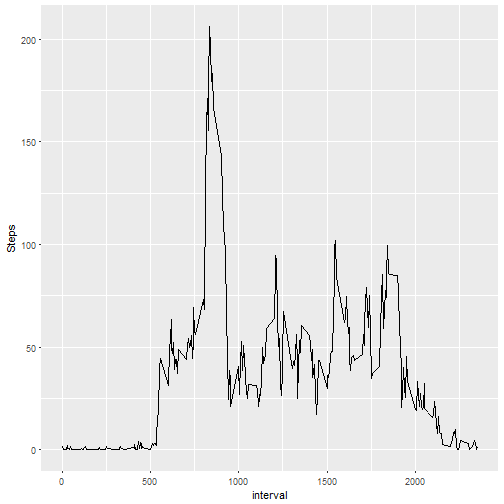
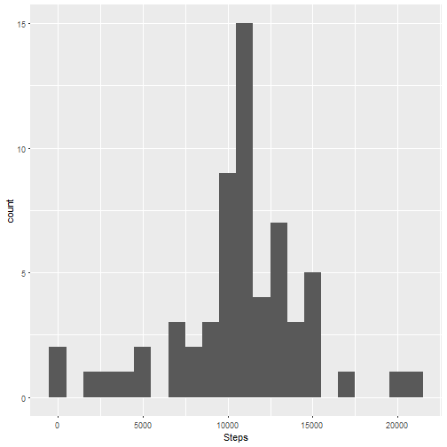

## 1. Code for reading in the dataset and/or processing the data

Set the working directory, read the data and format the date as follows.


```r
library(ggplot2)
setwd("C:/Users/joso/Desktop/Coursera/Unit 5 - Reproducable Research")
data <- read.csv("activity.csv")
data$date <- as.Date(data$date, format = "%Y-%m-%d")
head(data)
```

```
##   steps       date interval
## 1    NA 2012-10-01        0
## 2    NA 2012-10-01        5
## 3    NA 2012-10-01       10
## 4    NA 2012-10-01       15
## 5    NA 2012-10-01       20
## 6    NA 2012-10-01       25
```


## 2. Histogram of the total number of steps taken each day


```r
stepsPerDay <- with(data, aggregate(steps, by = list(date = date), FUN = sum))
names(stepsPerDay)[2] <- "Steps"

q2 <- ggplot(stepsPerDay, aes(Steps))
q2 <- q2 + geom_histogram(binwidth = 1000)
q2
```

```
## Warning: Removed 8 rows containing non-finite values (stat_bin).
```


## 3. Mean and median number of steps taken each day


```r
q3_mean <- mean(stepsPerDay$Steps, na.rm = T)
q3_median <- median(stepsPerDay$Steps, na.rm = T)
```

The mean is 1.0766189 &times; 10<sup>4</sup> and the median is 10765.


## 4. Time series plot of the average number of steps taken


```r
stepsPerInterval <- with(subset(data, is.na(steps)==F), aggregate(steps, by = list(interval = interval), FUN = mean))
names(stepsPerInterval)[2] <- "Steps"
q4 <- ggplot(stepsPerInterval, aes(x=interval, y=Steps))
q4 <- q4 + geom_line()
q4
```




## 5. The 5-minute interval that, on average, contains the maximum number of steps


```r
q5 <- stepsPerInterval[stepsPerInterval$Steps==max(stepsPerInterval$Steps),1]
```

The 5-minute interval that, on average, contains the maximum number of steps is the one starting at 835
 

## 6. Code to describe and show a strategy for imputing missing data  


```r
q6_count <- nrow(data[is.na(data$steps)==T,])
q6_perc <- q6_count/nrow(data)*100

q6 <- merge(x = data, y = stepsPerInterval, by.x = "interval", by.y = "interval")
names(q6)[4] <- "avg_int_steps"

q6$cleanSteps <- q6$avg_int_steps
for (i in 1:nrow(q6)){
    if (is.na(q6$steps[i])==T){
        q6$cleanSteps[i] <- q6$avg_int_steps[i]
    }else
        q6$cleanSteps[i] <- q6$steps[i]
}
```

The strategy was to:
1. First check how many NAs are in the data: There are 2304 rows with NA for steps, which is 13.1147541% of the whole data set.
2. Find the average number of steps per 5-minute interval and save in a data.frame (called q6)
3. Merge the original data with the new data.frame
4. Whenever the original data is NA, replace with the average for that interval

## 7. Histogram of the total number of steps taken each day after missing values are imputed


```r
q7 <- with(q6, aggregate(cleanSteps, by = list(date = date), FUN = sum))
names(q7)[2] <- "Steps"

q7_mean <- mean(q7$Steps)
q7_median <- median(q7$Steps)

q7_hist <- ggplot(q7, aes(Steps))
q7_hist <- q7_hist + geom_histogram(binwidth = 1000)
q7_hist
```



Filling in the NAs gives the same mean 1.0766189 &times; 10<sup>4</sup> but a slightly different median 1.0766189 &times; 10<sup>4</sup>.


## 8. Panel plot comparing the average number of steps taken per 5-minute interval across weekdays and weekends


```r
q8 <- q6
q8$dayWeek <- weekdays(q8$date)
q8$weekendYN <- q8$dayWeek
for (i in 1:nrow(q8)){
    if (q8$dayWeek[i]=="Saturday" || q8$dayWeek[i]=="Sunday"){
        q8$weekendYN[i] <- "weekEnd"
    }else
        q8$weekendYN[i] <- "weekDay"
}

q8_data <- with(q8, aggregate(cleanSteps, by = list(interval = interval,
                                                    weekendYN = weekendYN), FUN = mean))
names(q8_data)[3] <- "Steps"
q8_plot <- ggplot(q8_data, aes(x=interval, y=Steps, color = weekendYN))
q8_plot <- q8_plot + geom_line()
q8_plot <- q8_plot + facet_grid(weekendYN ~ .)
q8_plot
```


## 9. All of the R code needed to reproduce the results (numbers, plots, etc.) in the report

Please see the code within the code chunk for each question.
